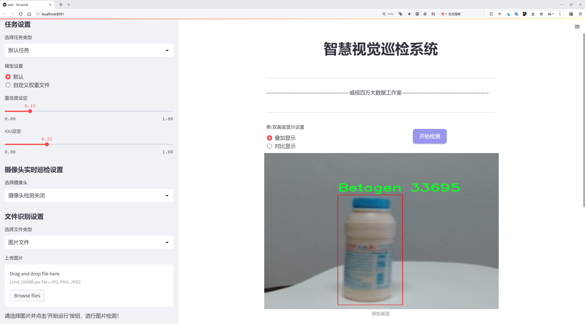
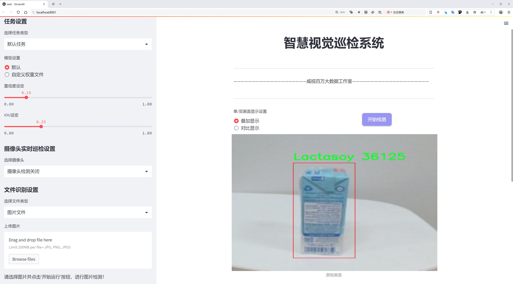
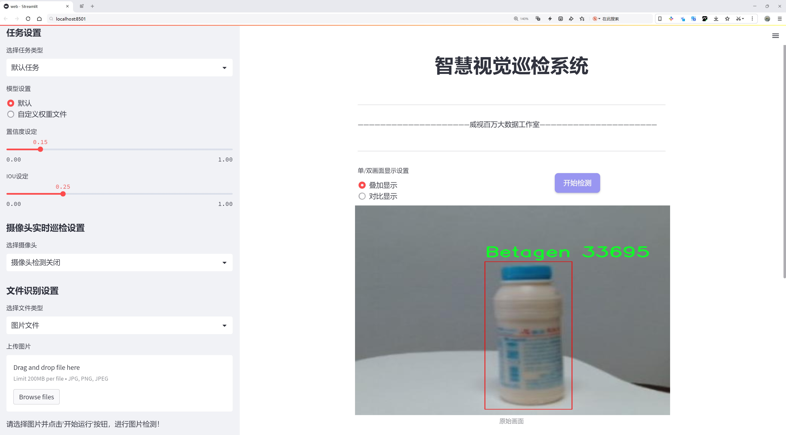
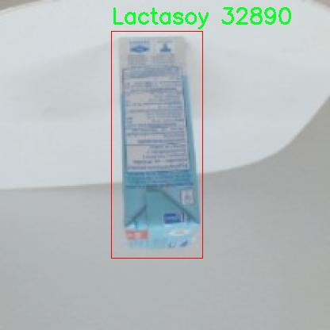
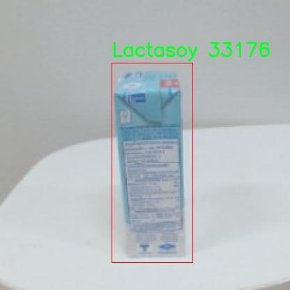
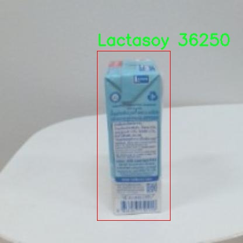
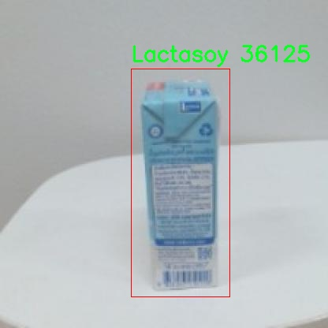

# 饮料品牌识别检测系统源码分享
 # [一条龙教学YOLOV8标注好的数据集一键训练_70+全套改进创新点发刊_Web前端展示]

### 1.研究背景与意义

项目参考[AAAI Association for the Advancement of Artificial Intelligence](https://gitee.com/qunmasj/projects)

项目来源[AACV Association for the Advancement of Computer Vision](https://github.com/qunshansj/good)

研究背景与意义

随着全球饮料市场的快速发展，品牌竞争愈发激烈，消费者对饮料品牌的认知和选择也日益多样化。在这一背景下，如何高效、准确地识别和分类饮料品牌，成为了品牌管理、市场营销以及消费者行为研究等领域的重要课题。传统的人工识别方法不仅耗时耗力，而且在处理大规模数据时，容易出现主观偏差和识别错误。因此，借助计算机视觉技术，尤其是深度学习中的目标检测算法，来实现饮料品牌的自动识别，具有重要的理论和实际意义。

YOLO（You Only Look Once）系列算法因其高效的实时检测能力和较高的准确率，广泛应用于各类目标检测任务。YOLOv8作为该系列的最新版本，进一步提升了模型的性能，能够在复杂环境中快速、准确地识别多种目标。基于YOLOv8的饮料品牌识别系统，不仅能够提高识别的速度和准确性，还能够为饮料品牌的市场分析、消费者偏好研究提供强有力的数据支持。

本研究将基于一个包含9687张图像的饮料品牌数据集，进行YOLOv8模型的改进与应用。该数据集涵盖了五个主要饮料品牌：Betagen、DutchMill、Lactasoy等。这些品牌在市场上具有较高的知名度，且各自的产品特征明显，适合进行目标检测和品牌识别的研究。通过对该数据集的深入分析和模型训练，期望能够实现对不同品牌饮料的高效识别，为品牌管理和市场营销提供数据支持。

此外，饮料品牌识别系统的构建不仅限于市场营销的应用，还可以在多个领域发挥重要作用。例如，在自动售货机、智能零售等场景中，能够实时识别顾客选择的饮料品牌，从而实现个性化推荐和精准营销；在食品安全监测中，能够快速识别潜在的伪劣产品，保障消费者的权益；在物流管理中，能够提高饮料产品的追踪和管理效率。

综上所述，基于改进YOLOv8的饮料品牌识别系统的研究，不仅具有重要的学术价值，也具备广泛的应用前景。通过该研究，期望能够推动计算机视觉技术在饮料行业的应用，提升品牌识别的智能化水平，同时为相关领域的研究提供新的思路和方法。随着技术的不断进步，未来的饮料品牌识别系统将更加智能化、自动化，为消费者和企业创造更大的价值。

### 2.图片演示







##### 注意：由于此博客编辑较早，上面“2.图片演示”和“3.视频演示”展示的系统图片或者视频可能为老版本，新版本在老版本的基础上升级如下：（实际效果以升级的新版本为准）

  （1）适配了YOLOV8的“目标检测”模型和“实例分割”模型，通过加载相应的权重（.pt）文件即可自适应加载模型。

  （2）支持“图片识别”、“视频识别”、“摄像头实时识别”三种识别模式。

  （3）支持“图片识别”、“视频识别”、“摄像头实时识别”三种识别结果保存导出，解决手动导出（容易卡顿出现爆内存）存在的问题，识别完自动保存结果并导出到tempDir中。

  （4）支持Web前端系统中的标题、背景图等自定义修改，后面提供修改教程。

  另外本项目提供训练的数据集和训练教程,暂不提供权重文件（best.pt）,需要您按照教程进行训练后实现图片演示和Web前端界面演示的效果。

### 3.视频演示

[3.1 视频演示](https://www.bilibili.com/video/BV1QzHpecEz7/?vd_source=ff015de2d29cbe2a9cdbfa7064407a08)

### 4.数据集信息展示

##### 4.1 本项目数据集详细数据（类别数＆类别名）

nc: 4
names: ['0', 'Betagen', 'DutchMill', 'Lactasoy']


##### 4.2 本项目数据集信息介绍

数据集信息展示

在本研究中，我们采用了名为“PJBL”的数据集，以改进YOLOv8模型在饮料品牌识别系统中的表现。该数据集专门针对饮料品牌的分类任务，包含了四个主要类别，分别是“Betagen”、“DutchMill”、“Lactasoy”以及一个标记为“0”的类别，后者通常用于表示未分类或背景图像。这种设计使得数据集在多样性和复杂性上具备了良好的基础，为模型的训练和测试提供了丰富的样本。

“PJBL”数据集的构建过程注重数据的多样性和代表性，确保每个类别都能充分反映出其品牌特征。数据集中包含了不同环境、不同光照条件下的饮料图像，这对于提升模型的鲁棒性至关重要。尤其是在饮料品牌识别任务中，环境因素如光照、角度和背景都会对识别结果产生显著影响。因此，数据集中的图像不仅包括标准的产品展示图，还涵盖了消费者在实际场景中拍摄的照片，这样的设计旨在模拟真实世界中的应用场景，提升模型在实际应用中的准确性和可靠性。

在类别的选择上，Betagen、DutchMill和Lactasoy都是在市场上具有一定知名度的饮料品牌。Betagen以其健康的乳制品而受到消费者的青睐，DutchMill则以其多样化的饮品选择和鲜明的品牌形象而闻名，而Lactasoy则在植物基饮品领域占据了一席之地。这些品牌的选择不仅考虑了市场的多样性，也反映了消费者的偏好和饮食趋势，为模型的训练提供了具有现实意义的背景。

数据集的标签系统设计合理，能够有效支持YOLOv8模型的训练需求。每个类别的样本都经过精确标注，确保模型在学习过程中能够准确理解不同品牌之间的特征差异。通过对比分析，模型能够学习到每个品牌的独特视觉特征，例如包装设计、颜色搭配以及标志性元素等。这种细致的标注和丰富的样本量为模型的深度学习提供了坚实的基础。

此外，数据集的规模和样本数量也是影响模型性能的重要因素。PJBL数据集经过精心筛选，确保每个类别都拥有足够的样本量，以便模型能够进行有效的特征学习。通过多轮的实验和验证，我们将不断优化数据集的构建，确保其在不同训练阶段都能发挥最佳效果。

综上所述，PJBL数据集为改进YOLOv8的饮料品牌识别系统提供了全面而丰富的支持。通过对数据集的深入分析和合理利用，我们期望能够提升模型的识别准确率，使其在实际应用中更具实用性和可靠性。随着研究的深入，我们将继续探索数据集的潜力，推动饮料品牌识别技术的发展。










### 5.全套项目环境部署视频教程（零基础手把手教学）

[5.1 环境部署教程链接（零基础手把手教学）](https://www.ixigua.com/7404473917358506534?logTag=c807d0cbc21c0ef59de5)


[5.2 安装Python虚拟环境创建和依赖库安装视频教程链接（零基础手把手教学）](https://www.ixigua.com/7404474678003106304?logTag=1f1041108cd1f708b01a)

### 6.手把手YOLOV8训练视频教程（零基础小白有手就能学会）

[6.1 环境部署教程链接（零基础手把手教学）](https://www.ixigua.com/7404477157818401292?logTag=d31a2dfd1983c9668658)

### 7.70+种全套YOLOV8创新点代码加载调参视频教程（一键加载写好的改进模型的配置文件）

[7.1 环境部署教程链接（零基础手把手教学）](https://www.ixigua.com/7404478314661806627?logTag=29066f8288e3f4eea3a4)

### 8.70+种全套YOLOV8创新点原理讲解（非科班也可以轻松写刊发刊，V10版本正在科研待更新）

由于篇幅限制，每个创新点的具体原理讲解就不一一展开，具体见下列网址中的创新点对应子项目的技术原理博客网址【Blog】：


[8.1 70+种全套YOLOV8创新点原理讲解链接](https://gitee.com/qunmasj/good)

### 9.系统功能展示（检测对象为举例，实际内容以本项目数据集为准）

图9.1.系统支持检测结果表格显示

  图9.2.系统支持置信度和IOU阈值手动调节

  图9.3.系统支持自定义加载权重文件best.pt(需要你通过步骤5中训练获得)

  图9.4.系统支持摄像头实时识别

  图9.5.系统支持图片识别

  图9.6.系统支持视频识别

  图9.7.系统支持识别结果文件自动保存

  图9.8.系统支持Excel导出检测结果数据


### 10.原始YOLOV8算法原理

原始YOLOv8算法原理

YOLOv8算法作为目标检测领域的最新进展，继承并优化了YOLO系列模型的诸多优点，展现出卓越的性能和灵活性。其核心思想在于将目标检测的效率与准确性进行了深度融合，使得该算法在实际应用中表现出色。YOLOv8不仅在结构上进行了创新，还在损失函数和样本匹配策略上做出了显著改进，从而使得其在多种场景下均能保持高效的检测能力。

首先，YOLOv8在骨干网络的设计上延续了跨级结构（CSP）的理念，旨在提高特征提取的效率。与YOLOv5相比，YOLOv8对C3模块进行了优化，采用了更轻量的C2F模块，这一变化使得模型在保持高效特征提取的同时，显著降低了计算复杂度。C2F模块通过增加跳层连接和Split操作，增强了信息流动性，使得特征融合更加高效。此外，YOLOv8保留了空间金字塔池化（SPPF）模块，这一模块在处理多尺度特征时表现优异，能够有效提升模型对不同尺寸目标的检测能力。

在特征融合层，YOLOv8引入了BiFPN（双向特征金字塔网络），通过高效的双向跨尺度连接和加权特征融合，进一步提升了对不同尺度特征信息的提取速度。这种设计不仅增强了模型的灵活性，还使得YOLOv8在面对复杂场景时能够快速适应，保证了目标检测的准确性。

YOLOv8的检测头部分也经历了重大变革。传统的耦合头被解耦头所取代，模型从Anchor-Based检测转变为Anchor-Free检测。这一转变使得YOLOv8在处理目标时不再依赖于预设的锚框，从而减少了模型对锚框参数的敏感性，提升了目标检测的灵活性和准确性。解耦头的设计使得分类和回归任务可以独立进行，从而进一步优化了检测性能。

损失函数的设计也是YOLOv8的一大亮点。新的损失策略通过变焦损失计算分类损失，结合数据平均保真度损失和完美交并比损失来计算边界框损失。这种多层次的损失计算方式，使得模型在训练过程中能够更好地平衡分类和定位的准确性，从而提高了整体检测性能。通过这些创新，YOLOv8能够在各种硬件平台上实现高效运行，适应从CPU到GPU的多种计算环境。

在实际应用中，YOLOv8的轻量化特性使其能够广泛应用于实时目标检测任务。例如，在智能监控、自动驾驶、无人机巡检等领域，YOLOv8都展现出了极高的实用价值。其出色的性能不仅体现在检测速度上，更在于其在复杂场景下的高准确率。通过自制数据集的实验验证，YOLOv8在目标检测任务中表现出色，证明了其在实际应用中的有效性。

总的来说，YOLOv8算法通过一系列创新和优化，成功地将目标检测的效率与准确性提升到了一个新的高度。其在骨干网络、特征融合、检测头和损失函数等多个方面的改进，使得YOLOv8不仅是一款高效的目标检测模型，更是计算机视觉领域中的一项重要进展。随着YOLOv8的推广和应用，未来在目标检测技术的发展中，YOLOv8无疑将发挥重要的作用，推动这一领域的进一步发展。


### 11.项目核心源码讲解（再也不用担心看不懂代码逻辑）

#### 11.1 ui.py

以下是经过精简和注释的核心代码部分：

```python
import sys
import subprocess
from QtFusion.path import abs_path

def run_script(script_path):
    """
    使用当前 Python 环境运行指定的脚本。

    Args:
        script_path (str): 要运行的脚本路径
    """
    # 获取当前 Python 解释器的路径
    python_path = sys.executable

    # 构建运行命令，使用 streamlit 运行指定的脚本
    command = f'"{python_path}" -m streamlit run "{script_path}"'

    # 执行命令并等待其完成
    result = subprocess.run(command, shell=True)
    
    # 检查命令执行结果，如果返回码不为0，则表示出错
    if result.returncode != 0:
        print("脚本运行出错。")

# 主程序入口
if __name__ == "__main__":
    # 获取要运行的脚本的绝对路径
    script_path = abs_path("web.py")

    # 调用函数运行指定的脚本
    run_script(script_path)
```

### 代码注释说明：
1. **导入模块**：
   - `sys`：用于获取当前 Python 解释器的路径。
   - `subprocess`：用于执行外部命令。
   - `abs_path`：从 `QtFusion.path` 模块导入的函数，用于获取文件的绝对路径。

2. **`run_script` 函数**：
   - 该函数接收一个脚本路径作为参数，并使用当前 Python 环境运行该脚本。
   - 使用 `sys.executable` 获取当前 Python 解释器的路径，以确保使用正确的 Python 环境。
   - 构建一个命令字符串，使用 `streamlit` 运行指定的脚本。
   - 使用 `subprocess.run` 执行命令，并检查返回码以判断脚本是否成功运行。

3. **主程序入口**：
   - 在脚本作为主程序运行时，获取要执行的脚本 `web.py` 的绝对路径。
   - 调用 `run_script` 函数来执行该脚本。

这个程序文件 `ui.py` 是一个用于运行指定 Python 脚本的简单工具，主要依赖于 `subprocess` 模块来执行命令行指令。程序的功能是通过当前的 Python 环境来运行一个名为 `web.py` 的脚本，通常这个脚本可能是一个使用 Streamlit 框架构建的 Web 应用。

首先，程序导入了必要的模块，包括 `sys`、`os` 和 `subprocess`。其中，`sys` 模块用于获取当前 Python 解释器的路径，`os` 模块可能用于处理文件路径，而 `subprocess` 模块则用于在新的进程中执行命令。

接下来，定义了一个名为 `run_script` 的函数，该函数接受一个参数 `script_path`，表示要运行的脚本的路径。在函数内部，首先获取当前 Python 解释器的路径，并将其存储在 `python_path` 变量中。然后，构建一个命令字符串，格式为 `"{python_path}" -m streamlit run "{script_path}"`，这个命令会使用当前的 Python 解释器来运行 Streamlit，并指定要运行的脚本。

使用 `subprocess.run` 方法执行构建好的命令，`shell=True` 参数表示在 shell 中执行该命令。执行后，程序会检查返回的结果，如果返回码不为 0，表示脚本运行出错，则会打印出相应的错误信息。

在文件的最后部分，使用 `if __name__ == "__main__":` 语句来确保只有在直接运行该文件时才会执行后面的代码。此时，程序指定了要运行的脚本路径为 `web.py`，并调用 `run_script` 函数来执行这个脚本。

总的来说，这个文件的主要功能是提供一个简单的接口，通过当前的 Python 环境来运行一个 Streamlit 应用，便于开发者快速启动和测试 Web 应用。

#### 11.2 ultralytics\trackers\bot_sort.py

以下是代码中最核心的部分，并附上详细的中文注释：

```python
class BOTrack(STrack):
    """
    BOTrack类是STrack类的扩展版本，添加了物体跟踪功能。
    """

    shared_kalman = KalmanFilterXYWH()  # 所有BOTrack实例共享的卡尔曼滤波器

    def __init__(self, tlwh, score, cls, feat=None, feat_history=50):
        """初始化BOTrack实例，设置初始参数，包括特征历史、平滑因子和当前特征。"""
        super().__init__(tlwh, score, cls)  # 调用父类构造函数

        self.smooth_feat = None  # 平滑特征向量
        self.curr_feat = None  # 当前特征向量
        if feat is not None:
            self.update_features(feat)  # 如果提供了特征，则更新特征
        self.features = deque([], maxlen=feat_history)  # 存储特征向量的双端队列，最大长度为feat_history
        self.alpha = 0.9  # 指数移动平均的平滑因子

    def update_features(self, feat):
        """更新特征向量，并使用指数移动平均进行平滑处理。"""
        feat /= np.linalg.norm(feat)  # 归一化特征向量
        self.curr_feat = feat  # 更新当前特征
        if self.smooth_feat is None:
            self.smooth_feat = feat  # 如果平滑特征为空，则直接赋值
        else:
            # 使用指数移动平均更新平滑特征
            self.smooth_feat = self.alpha * self.smooth_feat + (1 - self.alpha) * feat
        self.features.append(feat)  # 将当前特征添加到特征队列中
        self.smooth_feat /= np.linalg.norm(self.smooth_feat)  # 归一化平滑特征

    def predict(self):
        """使用卡尔曼滤波器预测均值和协方差。"""
        mean_state = self.mean.copy()  # 复制当前均值状态
        if self.state != TrackState.Tracked:
            mean_state[6] = 0  # 如果状态不是跟踪状态，则将速度设为0
            mean_state[7] = 0

        # 使用卡尔曼滤波器进行预测
        self.mean, self.covariance = self.kalman_filter.predict(mean_state, self.covariance)

    @property
    def tlwh(self):
        """获取当前边界框位置，格式为(左上角x, 左上角y, 宽度, 高度)。"""
        if self.mean is None:
            return self._tlwh.copy()  # 如果均值为空，返回初始值
        ret = self.mean[:4].copy()  # 复制均值的前四个元素
        ret[:2] -= ret[2:] / 2  # 计算左上角坐标
        return ret  # 返回左上角坐标和宽高

class BOTSORT(BYTETracker):
    """
    BOTSORT类是BYTETracker类的扩展版本，设计用于使用ReID和GMC算法进行物体跟踪。
    """

    def __init__(self, args, frame_rate=30):
        """初始化BOTSORT实例，设置ReID模块和GMC算法。"""
        super().__init__(args, frame_rate)  # 调用父类构造函数
        self.proximity_thresh = args.proximity_thresh  # 空间接近阈值
        self.appearance_thresh = args.appearance_thresh  # 外观相似性阈值

        if args.with_reid:
            self.encoder = None  # 如果启用ReID，则设置编码器为None
        self.gmc = GMC(method=args.gmc_method)  # 初始化GMC算法

    def init_track(self, dets, scores, cls, img=None):
        """使用检测结果、分数和类别初始化跟踪。"""
        if len(dets) == 0:
            return []  # 如果没有检测结果，返回空列表
        if self.args.with_reid and self.encoder is not None:
            features_keep = self.encoder.inference(img, dets)  # 获取ReID特征
            return [BOTrack(xyxy, s, c, f) for (xyxy, s, c, f) in zip(dets, scores, cls, features_keep)]  # 返回带特征的BOTrack实例
        else:
            return [BOTrack(xyxy, s, c) for (xyxy, s, c) in zip(dets, scores, cls)]  # 返回不带特征的BOTrack实例

    def multi_predict(self, tracks):
        """使用YOLOv8模型预测和跟踪多个物体。"""
        BOTrack.multi_predict(tracks)  # 调用BOTrack的多重预测方法
```

以上代码是YOLOv8物体跟踪的核心部分，包含了BOTrack和BOTSORT类的主要功能和方法。BOTrack类负责单个物体的跟踪，而BOTSORT类则负责初始化和管理多个物体的跟踪。

这个程序文件`ultralytics/trackers/bot_sort.py`实现了一个基于YOLOv8的目标跟踪算法，主要包含两个类：`BOTrack`和`BOTSORT`。`BOTrack`类是对YOLOv8中`STrack`类的扩展，增加了对象跟踪的功能，而`BOTSORT`类则是对`BYTETracker`类的扩展，设计用于结合ReID（重识别）和GMC（全局运动一致性）算法进行目标跟踪。

在`BOTrack`类中，定义了一些属性和方法来处理目标的特征更新和状态预测。它使用共享的卡尔曼滤波器来跟踪目标的状态，包括位置和速度。特征向量通过指数移动平均进行平滑处理，以提高跟踪的稳定性。类中提供了`update_features`方法来更新和光滑特征向量，`predict`方法用于预测目标的状态，`re_activate`和`update`方法用于在跟踪过程中更新目标的状态。`tlwh`属性用于获取当前目标的位置，`multi_predict`方法可以同时预测多个目标的状态。

`BOTSORT`类则主要负责初始化跟踪、计算目标之间的距离、以及对多个目标进行预测。它可以根据给定的参数选择是否启用ReID模块，并使用GMC算法进行数据关联。`init_track`方法用于根据检测结果初始化跟踪，`get_dists`方法计算跟踪目标与检测目标之间的距离，包括使用IoU（交并比）和ReID特征的距离。`multi_predict`方法调用`BOTrack`中的方法来处理多个目标的预测。

整体来看，这个文件实现了一个复杂的目标跟踪系统，结合了卡尔曼滤波、特征平滑、ReID和GMC算法，旨在提高目标跟踪的准确性和鲁棒性。使用时，可以通过创建`BOTSORT`实例并调用其方法来进行目标跟踪，支持多种配置选项以适应不同的应用场景。

#### 11.3 ultralytics\models\sam\modules\sam.py

以下是代码中最核心的部分，并附上详细的中文注释：

```python
from typing import List
import torch
from torch import nn
from .decoders import MaskDecoder
from .encoders import ImageEncoderViT, PromptEncoder

class Sam(nn.Module):
    """
    Sam（Segment Anything Model）旨在进行对象分割任务。它使用图像编码器生成图像嵌入，并使用提示编码器对各种类型的输入提示进行编码。这些嵌入随后被掩码解码器用于预测对象掩码。
    """

    mask_threshold: float = 0.0  # 掩码预测的阈值
    image_format: str = "RGB"     # 输入图像的格式，默认为'RGB'

    def __init__(
        self,
        image_encoder: ImageEncoderViT,  # 图像编码器，用于将图像编码为嵌入
        prompt_encoder: PromptEncoder,    # 提示编码器，用于编码各种类型的输入提示
        mask_decoder: MaskDecoder,        # 掩码解码器，从图像嵌入和编码的提示中预测掩码
        pixel_mean: List[float] = (123.675, 116.28, 103.53),  # 图像归一化的均值
        pixel_std: List[float] = (58.395, 57.12, 57.375),      # 图像归一化的标准差
    ) -> None:
        """
        初始化Sam类，以便从图像和输入提示中预测对象掩码。

        参数:
            image_encoder (ImageEncoderViT): 用于将图像编码为图像嵌入的主干网络。
            prompt_encoder (PromptEncoder): 编码各种类型的输入提示。
            mask_decoder (MaskDecoder): 从图像嵌入和编码的提示中预测掩码。
            pixel_mean (List[float], optional): 用于归一化输入图像像素的均值，默认为(123.675, 116.28, 103.53)。
            pixel_std (List[float], optional): 用于归一化输入图像像素的标准差，默认为(58.395, 57.12, 57.375)。
        """
        super().__init__()  # 调用父类nn.Module的初始化方法
        self.image_encoder = image_encoder  # 初始化图像编码器
        self.prompt_encoder = prompt_encoder  # 初始化提示编码器
        self.mask_decoder = mask_decoder  # 初始化掩码解码器
        # 注册图像归一化的均值和标准差，作为模型的缓冲区，不会被视为模型的参数
        self.register_buffer("pixel_mean", torch.Tensor(pixel_mean).view(-1, 1, 1), False)
        self.register_buffer("pixel_std", torch.Tensor(pixel_std).view(-1, 1, 1), False)
```

### 代码核心部分说明：
1. **类定义**：`Sam`类继承自`nn.Module`，是一个用于对象分割的模型。
2. **属性**：
   - `mask_threshold`：用于掩码预测的阈值。
   - `image_format`：指定输入图像的格式。
3. **初始化方法**：
   - 接收图像编码器、提示编码器和掩码解码器作为参数，并进行初始化。
   - 还包括用于图像归一化的均值和标准差，这些值被注册为模型的缓冲区，以便在推理时使用。

这个程序文件定义了一个名为 `Sam` 的类，属于 Ultralytics YOLO 项目的一部分，主要用于对象分割任务。该类继承自 PyTorch 的 `nn.Module`，这是构建神经网络模型的基础类。

在类的文档字符串中，简要介绍了 `Sam` 模型的功能和结构。该模型利用图像编码器生成图像嵌入，并通过提示编码器对不同类型的输入提示进行编码。生成的嵌入随后被掩码解码器使用，以预测对象的掩码。

类中定义了几个属性，包括 `mask_threshold`（掩码预测的阈值）、`image_format`（输入图像的格式，默认为 'RGB'）、`image_encoder`（用于将图像编码为嵌入的主干网络）、`prompt_encoder`（用于编码各种输入提示）、`mask_decoder`（根据图像和提示嵌入预测对象掩码）、`pixel_mean` 和 `pixel_std`（用于图像归一化的均值和标准差）。

在 `__init__` 方法中，类的初始化接受三个主要参数：`image_encoder`、`prompt_encoder` 和 `mask_decoder`，分别对应图像编码器、提示编码器和掩码解码器。此外，还可以选择性地传入用于图像归一化的均值和标准差，默认值已在文档中给出。

在初始化过程中，调用了父类的构造函数，并将传入的编码器和解码器赋值给相应的属性。同时，使用 `register_buffer` 方法注册了 `pixel_mean` 和 `pixel_std`，这两个属性不会被视为模型的参数，但在模型的前向传播中仍然可以使用。

总的来说，这个类为对象分割任务提供了一个结构化的框架，结合了图像编码、提示编码和掩码解码的功能，便于后续的模型训练和推理。

#### 11.4 train.py

以下是经过简化和注释的核心代码部分：

```python
import os
import torch
import yaml
from ultralytics import YOLO  # 导入YOLO模型库
from QtFusion.path import abs_path  # 导入路径处理函数

# 设置设备为GPU（如果可用），否则使用CPU
device = "0" if torch.cuda.is_available() else "cpu"

if __name__ == '__main__':  # 确保该模块被直接运行时才执行以下代码
    # 定义工作进程数量和批次大小
    workers = 1
    batch = 2

    # 数据集名称
    data_name = "data"
    # 获取数据集配置文件的绝对路径
    data_path = abs_path(f'datasets/{data_name}/{data_name}.yaml', path_type='current')
    
    # 获取数据集目录路径
    directory_path = os.path.dirname(data_path)

    # 读取YAML文件，保持原有顺序
    with open(data_path, 'r') as file:
        data = yaml.load(file, Loader=yaml.FullLoader)
    
    # 修改YAML文件中的路径项
    if 'path' in data:
        data['path'] = directory_path  # 更新路径为数据集目录
        # 将修改后的数据写回YAML文件
        with open(data_path, 'w') as file:
            yaml.safe_dump(data, file, sort_keys=False)

    # 加载YOLOv8模型配置
    model = YOLO(model='./ultralytics/cfg/models/v8/yolov8s.yaml', task='detect')
    
    # 开始训练模型
    results2 = model.train(
        data=data_path,  # 指定训练数据的配置文件路径
        device=device,  # 使用指定的设备进行训练
        workers=workers,  # 指定使用的工作进程数量
        imgsz=640,  # 输入图像的大小
        epochs=100,  # 训练的轮数
        batch=batch,  # 每个批次的大小
        name='train_v8_' + data_name  # 训练任务的名称
    )
```

### 代码注释说明：
1. **导入必要的库**：导入了处理文件路径、模型训练和YAML文件的库。
2. **设备选择**：根据是否有可用的GPU选择训练设备。
3. **数据集配置**：定义数据集名称并获取其配置文件的绝对路径。
4. **读取和修改YAML文件**：读取数据集的YAML配置文件，更新其中的路径项，并将修改后的内容写回文件。
5. **模型加载**：加载YOLOv8模型的配置文件。
6. **模型训练**：使用指定的参数开始训练模型，包括数据路径、设备、工作进程数量、图像大小、训练轮数和批次大小。

该程序文件`train.py`的主要功能是使用YOLOv8模型进行目标检测的训练。首先，程序导入了必要的库，包括`os`、`torch`、`yaml`和`ultralytics`中的YOLO模型。接着，程序通过判断CUDA是否可用来选择设备，如果可用则使用GPU（设备编号为"0"），否则使用CPU。

在`__main__`模块中，程序首先设置了一些训练参数，包括工作进程数量`workers`和批次大小`batch`。然后，定义了数据集的名称为`data`，并构建了数据集配置文件的绝对路径。使用`abs_path`函数获取数据集的路径，并将路径中的分隔符统一为Unix风格。

接下来，程序获取数据集目录的路径，并打开指定的YAML文件以读取数据集的配置信息。读取后，程序检查YAML文件中是否包含`path`项，如果有，则将其修改为当前目录路径，并将更新后的数据写回到YAML文件中。

随后，程序加载了YOLOv8的预训练模型，指定了模型的配置文件路径。接着，调用`model.train`方法开始训练模型，传入训练所需的参数，包括数据配置文件路径、设备选择、工作进程数量、输入图像大小、训练的epoch数量和批次大小，以及训练任务的名称。

整体来看，该程序实现了YOLOv8模型的训练流程，包括数据集配置的处理、模型的加载和训练参数的设置。

#### 11.5 ultralytics\data\dataset.py

以下是经过简化和注释的代码，保留了核心部分并添加了详细的中文注释：

```python
import numpy as np
import torch
from pathlib import Path
from ultralytics.utils import TQDM, get_hash, img2label_paths, LOGGER
from .base import BaseDataset

# Ultralytics 数据集缓存版本
DATASET_CACHE_VERSION = "1.0.3"

class YOLODataset(BaseDataset):
    """
    YOLO 数据集类，用于加载目标检测和/或分割标签。

    Args:
        data (dict, optional): 数据集 YAML 字典。默认为 None。
        task (str): 当前任务的显式参数，默认为 'detect'。
    """

    def __init__(self, *args, data=None, task="detect", **kwargs):
        """初始化 YOLODataset，配置分段和关键点的选项。"""
        self.use_segments = task == "segment"  # 是否使用分段
        self.use_keypoints = task == "pose"  # 是否使用关键点
        self.data = data
        assert not (self.use_segments and self.use_keypoints), "不能同时使用分段和关键点。"  # 只能选择一种任务
        super().__init__(*args, **kwargs)

    def cache_labels(self, path=Path("./labels.cache")):
        """
        缓存数据集标签，检查图像并读取形状。

        Args:
            path (Path): 缓存文件保存路径（默认: Path('./labels.cache')）。
        Returns:
            (dict): 标签字典。
        """
        x = {"labels": []}  # 初始化标签字典
        nm, nf, ne, nc, msgs = 0, 0, 0, 0, []  # 统计信息：缺失、找到、空、损坏的数量
        total = len(self.im_files)  # 图像文件总数

        # 使用多线程验证图像和标签
        with ThreadPool(NUM_THREADS) as pool:
            results = pool.imap(
                func=verify_image_label,
                iterable=zip(self.im_files, self.label_files)
            )
            pbar = TQDM(results, desc="扫描中...", total=total)  # 进度条
            for im_file, lb, shape, segments, keypoint, nm_f, nf_f, ne_f, nc_f, msg in pbar:
                nm += nm_f
                nf += nf_f
                ne += ne_f
                nc += nc_f
                if im_file:
                    x["labels"].append(
                        dict(
                            im_file=im_file,
                            shape=shape,
                            cls=lb[:, 0:1],  # 类别
                            bboxes=lb[:, 1:],  # 边界框
                            segments=segments,
                            keypoints=keypoint,
                            normalized=True,
                            bbox_format="xywh",
                        )
                    )
                if msg:
                    msgs.append(msg)
                pbar.desc = f"扫描中... {nf} 图像, {nm + ne} 背景, {nc} 损坏"
            pbar.close()

        if msgs:
            LOGGER.info("\n".join(msgs))  # 记录警告信息
        x["hash"] = get_hash(self.label_files + self.im_files)  # 计算标签文件和图像文件的哈希值
        save_dataset_cache_file(self.prefix, path, x)  # 保存缓存文件
        return x

    def get_labels(self):
        """返回 YOLO 训练的标签字典。"""
        self.label_files = img2label_paths(self.im_files)  # 获取标签文件路径
        cache_path = Path(self.label_files[0]).parent.with_suffix(".cache")  # 缓存文件路径
        try:
            cache, exists = load_dataset_cache_file(cache_path), True  # 尝试加载缓存文件
            assert cache["version"] == DATASET_CACHE_VERSION  # 检查版本
            assert cache["hash"] == get_hash(self.label_files + self.im_files)  # 检查哈希值
        except (FileNotFoundError, AssertionError):
            cache, exists = self.cache_labels(cache_path), False  # 如果加载失败，则缓存标签

        # 读取缓存
        labels = cache["labels"]
        if not labels:
            LOGGER.warning(f"警告 ⚠️ 在 {cache_path} 中未找到图像，训练可能无法正常工作。")
        self.im_files = [lb["im_file"] for lb in labels]  # 更新图像文件列表
        return labels

    def build_transforms(self, hyp=None):
        """构建并返回数据增强转换列表。"""
        transforms = []  # 初始化转换列表
        transforms.append(
            Format(
                bbox_format="xywh",
                normalize=True,
                return_mask=self.use_segments,
                return_keypoint=self.use_keypoints,
            )
        )
        return transforms

    @staticmethod
    def collate_fn(batch):
        """将数据样本合并为批次。"""
        new_batch = {}
        keys = batch[0].keys()
        values = list(zip(*[list(b.values()) for b in batch]))
        for i, k in enumerate(keys):
            value = values[i]
            if k == "img":
                value = torch.stack(value, 0)  # 将图像堆叠成一个张量
            new_batch[k] = value
        return new_batch

# 加载和保存缓存文件的函数
def load_dataset_cache_file(path):
    """从路径加载 Ultralytics *.cache 字典。"""
    cache = np.load(str(path), allow_pickle=True).item()  # 加载缓存字典
    return cache

def save_dataset_cache_file(prefix, path, x):
    """将 Ultralytics 数据集 *.cache 字典 x 保存到路径。"""
    x["version"] = DATASET_CACHE_VERSION  # 添加缓存版本
    if path.exists():
        path.unlink()  # 如果存在，则删除旧的缓存文件
    np.save(str(path), x)  # 保存新的缓存文件
    LOGGER.info(f"{prefix}新缓存已创建: {path}")
```

### 代码说明：
1. **YOLODataset 类**：这是一个用于加载 YOLO 格式数据集的类，支持目标检测和分割任务。
2. **cache_labels 方法**：用于缓存数据集标签，检查图像的有效性，并返回标签字典。
3. **get_labels 方法**：获取标签，尝试从缓存中加载，如果失败则重新缓存。
4. **build_transforms 方法**：构建数据增强的转换操作。
5. **collate_fn 方法**：将多个样本合并为一个批次，适用于 PyTorch 的数据加载。
6. **load_dataset_cache_file 和 save_dataset_cache_file 函数**：用于加载和保存数据集的缓存文件。

这个程序文件主要实现了YOLO（You Only Look Once）模型的数据集处理功能，主要用于目标检测和分割任务。文件中定义了几个类和方法，具体功能如下：

首先，导入了一些必要的库，包括`cv2`、`numpy`、`torch`和`torchvision`等。这些库为图像处理、数值计算和深度学习提供了支持。

接下来，定义了一个`YOLODataset`类，它继承自`BaseDataset`类。这个类用于加载YOLO格式的目标检测和分割标签。构造函数中接收一些参数，如数据字典和任务类型，并根据任务类型设置相应的标志。它确保在同一时间内不能同时使用分割和关键点。

`cache_labels`方法用于缓存数据集标签，检查图像并读取其形状。它使用多线程来提高处理速度，并在处理过程中记录缺失、找到、空和损坏的图像数量。最终，结果会被保存到指定的缓存文件中。

`get_labels`方法返回YOLO训练所需的标签字典。它尝试加载之前缓存的标签，如果缓存不存在或不匹配，则调用`cache_labels`方法重新生成标签。

`build_transforms`方法用于构建数据增强的转换操作，支持不同的增强策略，如马赛克、混合等。转换操作会根据任务类型进行调整。

`update_labels_info`方法用于自定义标签格式，处理边界框、分割和关键点信息，并将其转换为`Instances`对象。

`collate_fn`方法用于将数据样本整理成批次，以便于后续的训练过程。

接下来，定义了一个`ClassificationDataset`类，继承自`torchvision.datasets.ImageFolder`，用于处理YOLO分类数据集。构造函数中接收数据集路径、参数和增强设置，并验证图像的有效性。`__getitem__`方法用于获取指定索引的样本，支持在内存或磁盘上缓存图像。

`verify_images`方法用于验证数据集中所有图像的有效性，并返回有效的样本列表。

最后，定义了`load_dataset_cache_file`和`save_dataset_cache_file`两个函数，用于加载和保存数据集的缓存文件。`SemanticDataset`类是一个占位符，表示语义分割数据集的处理，但目前尚未实现具体功能。

整体来看，这个文件提供了YOLO模型所需的数据集管理和处理功能，支持目标检测、分割和分类任务，具有缓存机制以提高效率。

#### 11.6 ultralytics\models\yolo\classify\predict.py

以下是经过简化和注释的核心代码部分：

```python
import cv2
import torch
from PIL import Image
from ultralytics.engine.predictor import BasePredictor
from ultralytics.engine.results import Results
from ultralytics.utils import ops

class ClassificationPredictor(BasePredictor):
    """
    继承自 BasePredictor 类，用于基于分类模型进行预测的类。
    """

    def __init__(self, cfg=DEFAULT_CFG, overrides=None, _callbacks=None):
        """初始化 ClassificationPredictor，将任务设置为 'classify'。"""
        super().__init__(cfg, overrides, _callbacks)  # 调用父类构造函数
        self.args.task = "classify"  # 设置任务类型为分类
        self._legacy_transform_name = "ultralytics.yolo.data.augment.ToTensor"  # 旧版转换名称

    def preprocess(self, img):
        """将输入图像转换为模型兼容的数据类型。"""
        if not isinstance(img, torch.Tensor):  # 如果输入不是张量
            # 检查是否使用了旧版转换
            is_legacy_transform = any(
                self._legacy_transform_name in str(transform) for transform in self.transforms.transforms
            )
            if is_legacy_transform:  # 处理旧版转换
                img = torch.stack([self.transforms(im) for im in img], dim=0)
            else:
                # 将图像从 BGR 转换为 RGB，并应用转换
                img = torch.stack(
                    [self.transforms(Image.fromarray(cv2.cvtColor(im, cv2.COLOR_BGR2RGB))) for im in img], dim=0
                )
        # 将图像转换为张量并移动到模型设备上
        img = (img if isinstance(img, torch.Tensor) else torch.from_numpy(img)).to(self.model.device)
        # 根据模型精度选择数据类型
        return img.half() if self.model.fp16 else img.float()  # uint8 转换为 fp16/32

    def postprocess(self, preds, img, orig_imgs):
        """对预测结果进行后处理，返回 Results 对象。"""
        if not isinstance(orig_imgs, list):  # 如果原始图像不是列表
            orig_imgs = ops.convert_torch2numpy_batch(orig_imgs)  # 转换为 numpy 格式

        results = []
        for i, pred in enumerate(preds):  # 遍历每个预测结果
            orig_img = orig_imgs[i]  # 获取原始图像
            img_path = self.batch[0][i]  # 获取图像路径
            # 将结果添加到列表中
            results.append(Results(orig_img, path=img_path, names=self.model.names, probs=pred))
        return results  # 返回处理后的结果列表
```

### 代码说明：
1. **导入模块**：导入必要的库和模块，包括 OpenCV、PyTorch 和 PIL。
2. **ClassificationPredictor 类**：继承自 `BasePredictor`，用于分类任务的预测。
3. **初始化方法**：设置任务类型为分类，并处理旧版转换名称。
4. **预处理方法**：将输入图像转换为适合模型的格式，包括颜色空间转换和张量转换。
5. **后处理方法**：将模型的预测结果转换为 `Results` 对象，便于后续使用和分析。

这个程序文件是一个用于图像分类的预测器，名为 `ClassificationPredictor`，它继承自 `BasePredictor` 类。该类的主要功能是处理图像分类任务，支持使用不同的模型进行预测，包括 PyTorch 的 torchvision 分类模型。

在类的初始化方法 `__init__` 中，设置了任务类型为“分类”，并定义了一个用于处理图像的旧版转换名称。初始化时可以接收配置参数和覆盖参数。

`preprocess` 方法负责将输入图像转换为模型可以接受的数据类型。它首先检查输入是否为 PyTorch 张量，如果不是，则根据是否使用旧版转换来处理图像。如果使用旧版转换，直接将图像堆叠为一个张量；否则，先将图像从 BGR 格式转换为 RGB 格式，然后应用转换。最后，将图像转换为适合模型的浮点格式（fp16 或 fp32），并移动到模型所在的设备上。

`postprocess` 方法用于对模型的预测结果进行后处理，返回一个 `Results` 对象的列表。它首先检查原始图像是否为列表，如果不是，则将其转换为 NumPy 格式。然后，对于每个预测结果，提取原始图像和对应的路径，并将它们与预测的概率一起封装到 `Results` 对象中，最终返回这些结果。

这个类的设计使得用户可以方便地进行图像分类，支持多种模型，并提供了图像预处理和结果后处理的功能。用户可以通过传入模型和数据源来实例化这个预测器，并调用 `predict_cli` 方法进行预测。

### 12.系统整体结构（节选）

### 整体功能和构架概括

该项目主要是一个基于Ultralytics YOLO框架的计算机视觉应用，涉及目标检测、图像分类、分割和跟踪等功能。项目结构清晰，包含多个模块，每个模块负责特定的功能。整体上，项目的架构可以分为以下几个部分：

1. **用户界面（UI）**：通过 `ui.py` 提供了一个简单的命令行界面，用于启动和运行模型。
2. **目标跟踪**：通过 `bot_sort.py` 和 `track.py` 实现了基于YOLO的目标跟踪算法，支持多目标跟踪。
3. **模型定义**：`sam.py` 和 `amg.py` 中定义了不同的模型结构，用于对象分割和其他任务。
4. **数据处理**：`dataset.py` 负责数据集的加载、处理和增强，支持目标检测和分类任务。
5. **训练和预测**：`train.py`、`train.py`（分类）、`train.py`（分割）和 `predict.py` 提供了模型训练和预测的功能，支持不同类型的任务。
6. **解决方案模块**：`ai_gym.py` 和 `__init__.py` 提供了一些额外的功能和接口，可能用于与其他模块的集成。

### 文件功能整理表

| 文件路径                                      | 功能描述                                                                 |
|-----------------------------------------------|--------------------------------------------------------------------------|
| `ui.py`                                       | 提供命令行界面，启动和运行指定的Python脚本（如web.py）。                |
| `ultralytics/trackers/bot_sort.py`           | 实现基于YOLOv8的目标跟踪算法，结合ReID和GMC算法进行多目标跟踪。        |
| `ultralytics/models/sam/modules/sam.py`      | 定义了用于对象分割的Sam模型，结合图像编码和掩码解码功能。              |
| `train.py`                                    | 负责YOLOv8模型的训练，包括数据集配置和模型加载。                      |
| `ultralytics/data/dataset.py`                | 处理数据集的加载、缓存和增强，支持目标检测和分类任务。                 |
| `ultralytics/models/yolo/classify/predict.py`| 实现图像分类的预测器，支持图像预处理和结果后处理。                     |
| `ultralytics/models/yolo/classify/train.py`  | 负责YOLO分类模型的训练过程，设置训练参数和数据集。                    |
| `ultralytics/models/yolo/segment/train.py`   | 负责YOLO分割模型的训练过程，设置训练参数和数据集。                    |
| `ultralytics/solutions/ai_gym.py`            | 提供额外的功能和接口，可能用于与其他模块的集成。                        |
| `ultralytics/solutions/__init__.py`          | 初始化解决方案模块，可能包含一些公共功能或配置。                       |
| `ultralytics/models/sam/amg.py`              | 可能定义了与SAM模型相关的辅助功能或算法（具体功能需进一步分析）。      |
| `ultralytics/trackers/track.py`              | 实现目标跟踪的核心逻辑，可能与`bot_sort.py`协同工作。                  |
| `ultralytics/models/yolo/obb/val.py`         | 可能用于YOLO模型的验证过程，具体功能需进一步分析。                     |

以上表格总结了项目中各个文件的主要功能，便于理解整个项目的结构和功能模块。

注意：由于此博客编辑较早，上面“11.项目核心源码讲解（再也不用担心看不懂代码逻辑）”中部分代码可能会优化升级，仅供参考学习，完整“训练源码”、“Web前端界面”和“70+种创新点源码”以“13.完整训练+Web前端界面+70+种创新点源码、数据集获取”的内容为准。

### 13.完整训练+Web前端界面+70+种创新点源码、数据集获取


https://mbd.pub/o/bread/ZpqZmZxy